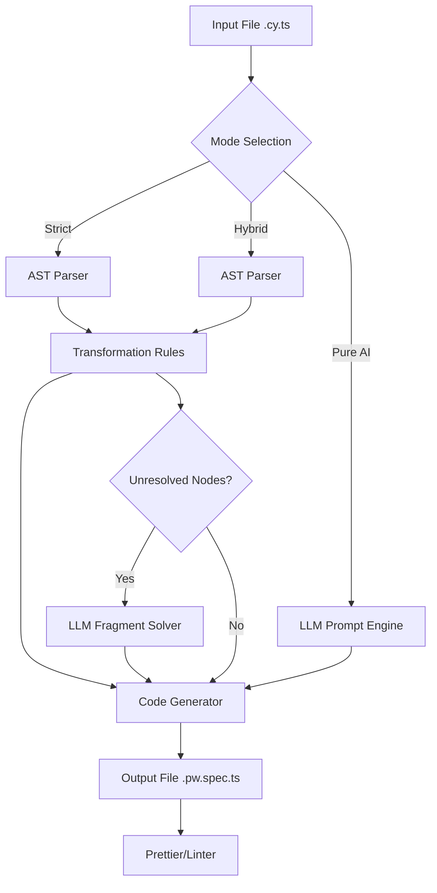

# 📄 PRD: Cy2Play (AI Test Converter) - Detailed Specification

## 1. Product Overview

### 1.1 Problem Statement
The industry is shifting from synchronous, chain-based testing frameworks (Cypress, WebdriverIO) to asynchronous, await-based frameworks (Playwright). However, migrating existing large test suites is:
1.  **Expensive**: Manual rewriting takes hours per file.
2.  **Error-Prone**: Humans miss `await` keywords or incorrect selector mappings.
3.  **Complex**: Logic patterns like "Interception" or "Custom Commands" do not map 1:1.

### 1.2 Solution
**Cy2Play** is an intelligent CLI tool that transpiles legacy test code into modern Playwright code. It is unique because it offers a **Hybrid Engine**: combining the speed/determinism of AST parsing with the reasoning capabilities of Large Language Models (LLMs), including support for local, privacy-focused models (Ollama).

### 1.3 Value Proposition
*   **For Enterprises**: Migrate 10,000 tests in a weekend without sending code to the cloud (Local LLM mode).
*   **For Developers**: Eliminate the "grunt work" of syntax conversion.
*   **For QA Leads**: Get an automated "Audit Report" of what changed and what needs review.

---

## 2. Core Features & Modes

### 2.1 The Three Conversion Modes

#### 🛡️ Mode 1: `strict` (Rule-Based Only)
*   **Description**: Uses Abstract Syntax Tree (AST) parsing (via `ts-morph`) to transform code deterministically.
*   **AI Usage**: 0%.
*   **Pros**: Instant, free, deterministic, privacy-safe.
*   **Cons**: Fails or comments-out unknown custom commands or complex logic loops.
*   **Best For**: Security-strict environments, simple CRUD tests.

#### 🧠 Mode 2: `pure-ai` (Full LLM Rewrite)
*   **Description**: Reads the test file content and prompts an LLM to "Rewrite this entire file in Playwright."
*   **AI Usage**: 100%.
*   **Pros**: Handles complex logic, variable scoping, and "intent" better than AST.
*   **Cons**: Slow, expensive (if using API), risk of "Hallucination" (inventing selectors that don't exist).
*   **Best For**: Highly complex, messy legacy files that break the AST parser.

#### ⚡ Mode 3: `hybrid` (Default & Recommended)
*   **Description**:
    1.  **Pass 1 (AST)**: Convert all standard calls (`visit`, `get`, `click`, `type`) and assertions using rules.
    2.  **Pass 2 (Scan)**: Identify "Unknown/Untransformed" nodes (e.g., `cy.loginWithSSO()`).
    3.  **Pass 3 (AI patch)**: Send *only* the specific blocks or lines to the LLM to resolve them into Playwright code.
*   **AI Usage**: ~10-20%.
*   **Pros**: Best of both worlds—speed of AST, smarts of LLM.

---

## 3. Detailed Architecture

### 3.1 Pipeline Flow


### 3.2 AI & Local LLM Provider Support
The system must support pluggable LLM backends via `LangChain`.

*   **OpenAI**: Standard `gpt-4` or `gpt-3.5-turbo`.
*   **Anthropic**: `claude-3-opus` (excellent at code).
*   **Local (Ollama/LM Studio)**:
    *   **Url**: Configurable (default `http://localhost:11434`).
    *   **Model**: Configurable (default `llama3` or `codellama`).
    *   **Context**: Must handle strict system prompts to output *only* code.

### 3.3 Configuration Schema (`cy2play.config.json`)
```json
{
  "mode": "hybrid", 
  "testFolder": "./cypress/e2e",
  "outputFolder": "./tests",
  "ai": {
    "provider": "ollama", 
    "model": "llama3",
    "baseUrl": "http://localhost:11434",
    "temperature": 0.2
  },
  "customCommands": {
    "login": "await page.login()", 
    "dataCy": "page.locator(`[data-cy='${args[0]}']`)"
  }
}
```

---

## 4. Technical Specifications

### 4.1 AST Transformation Logic (The Hard Part)

#### 4.1.1 Sync to Async Mutation
Cypress commands are synchronous chains. Playwright is `Promise`-based.
*   **Input**: `cy.get('.btn').click()`
*   **Logic**:
    1.  Identify call chain `get` -> `click`.
    2.  Split into `locator` and `action`.
    3.  Wrap in `await`.
*   **Output**: `await page.locator('.btn').click()`

#### 4.1.2 Scope Hoisting
*   **Input**:
    ```javascript
    cy.get('.item').then($el => {
        const txt = $el.text();
        cy.wrap(txt).should('eq', 'hello');
    })
    ```
*   **Output**:
    ```javascript
    const el = page.locator('.item');
    const txt = await el.innerText();
    expect(txt).toBe('hello');
    ```

### 4.2 Handling Edge Cases

| Feature | Cypress | Playwright Target | Hybrid Strategy |
| :--- | :--- | :--- | :--- |
| **Selectors** | `cy.get('[data-id=1]')` | `page.locator('[data-id=1]')` | Strict Rule |
| **Route** | `cy.intercept('/api/users')` | `page.route('/api/users', ...)` | LLM (Complex syntax) |
| **Time** | `cy.wait(5000)` | `await page.waitForTimeout(5000)` | Strict Rule (add warning) |
| **Assertion** | `.should('be.visible')` | `expect(loc).toBeVisible()` | Strict Rule |
| **Assertion** | `.should('have.css', 'color', 'red')` | `expect(loc).toHaveCSS(...)` | Strict Rule |
| **Hooks** | `beforeEach(() => {})` | `test.beforeEach(async ({ page }) => {})` | Strict Rule |
| **Plugins** | `cy.xpath(...)` | `page.locator('xpath=...')` | Hybrid/LLM |

---

## 5. User Experience (CLI)

### 5.1 Commands

**1. Standard Conversion (Hybrid)**
```bash
npx cy2play convert ./cypress/e2e
```

**2. Strict Mode (No AI)**
```bash
npx cy2play convert ./cypress/e2e --mode=strict
```

**3. Local LLM Mode**
```bash
npx cy2play convert ./cypress/e2e \
  --mode=hybrid \
  --llm-provider=ollama \
  --model=codellama
```

**4. Dry Run & Report**
```bash
npx cy2play convert --dry-run
# Output:
# ℹ️ Scanned 50 files.
# ⚠️ 12 files contain custom commands that require AI or manual config.
# 💰 Estimated Cost (if using OpenAI): $0.45
```

---

## 6. Implementation Stages (Granular)

### Phase 1: The Strict Engine (Weeks 1-2)
- [ ] Set up `ts-morph` project.
- [ ] Implement `SelectorTransformer`: regex/AST replacement for `cy.get`, `cy.contains`.
- [ ] Implement `ActionTransformer`: `click`, `type`, `check`.
- [ ] Implement `AssertionTransformer`: Chai `expect` to Jest/Playwright `expect`.
- [ ] **Deliverable**: CLI converts simple "Hello World" login tests perfectly.

### Phase 2: The Async Rewriter (Weeks 3-4)
- [ ] Implement `ChainBreaker`: Break `cy.get().click().should()` into multiple lines if needed.
- [ ] Implement `FunctionWrapper`: Automatically add `async` to parenet `it/test` blocks.
- [ ] Handle `then()` callbacks (unwrapping jQuery objects).
- [ ] **Deliverable**: Converts standard synchronous Cypress code to valid async/await TS.

### Phase 3: The AI Integration (Weeks 5-6)
- [ ] Integrate `LangChain`.
- [ ] Create `OllamaAdapter` and `OpenAIAdapter`.
- [ ] Implement `HybridOrchestrator`:
    - If AST fails to map a node -> Mark as `UNKNOWN`.
    - Collect `UNKNOWN` nodes.
    - Batch send to LLM: "Translate this Cypress chunk to Playwright".
    - Stitch result back into file.
- [ ] **Deliverable**: `--mode=hybrid` works with local Ollama.

### Phase 4: Polish & Config (Week 7)
- [ ] Build `cy2play.config.json` loader.
- [ ] Add `Prettier` pass to format output files.
- [ ] Add `ReportGenerator` (Markdown summary of changes).
- [ ] **Deliverable**: Beta release `v0.1.0`.

### Phase 5: "Auto-Fix" (Post-MVP)
- [ ] Run the generated Playwright test.
- [ ] If it fails -> Feed error + code back to LLM.
- [ ] "Self-Heal" the migration.
